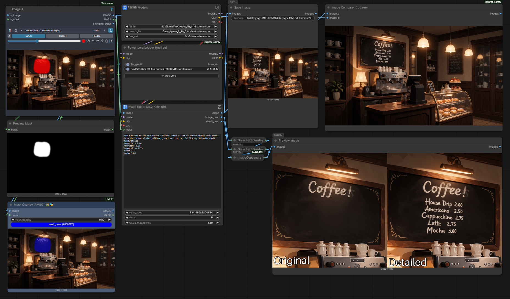
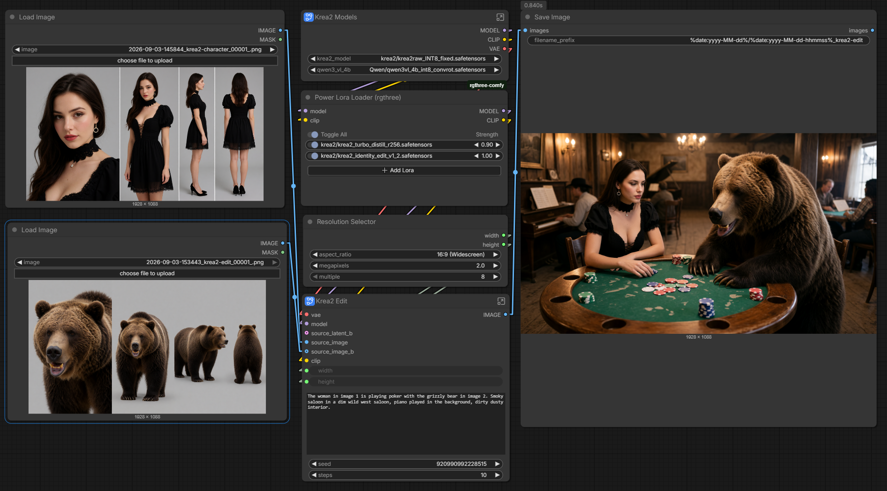
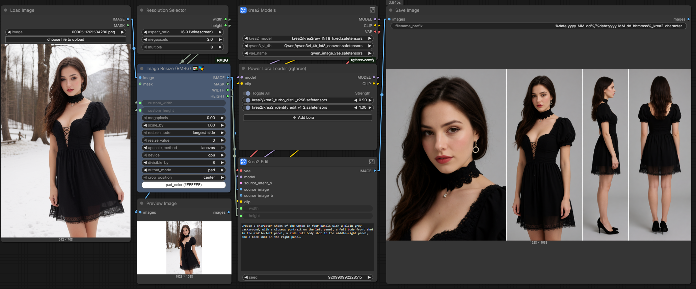
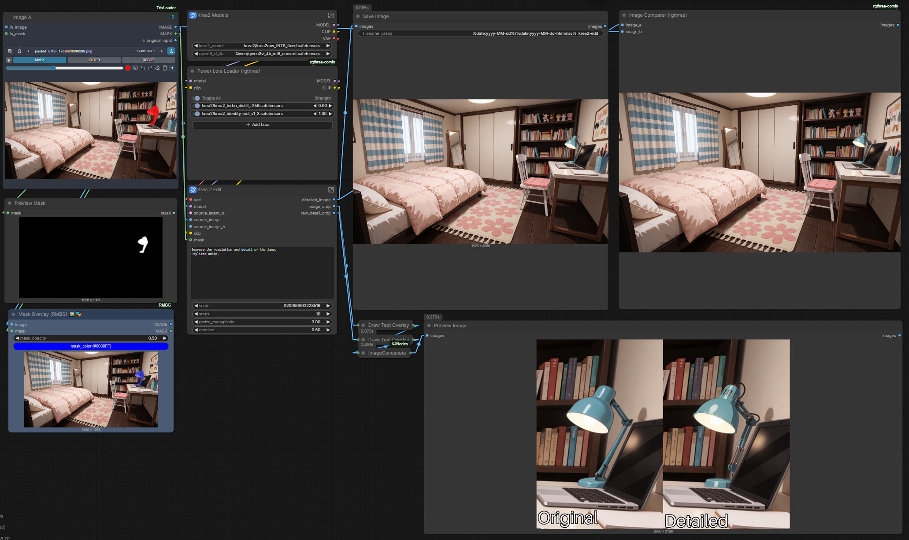
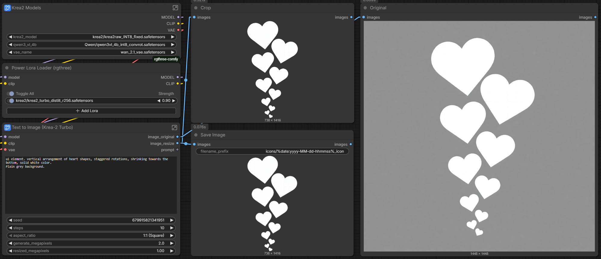
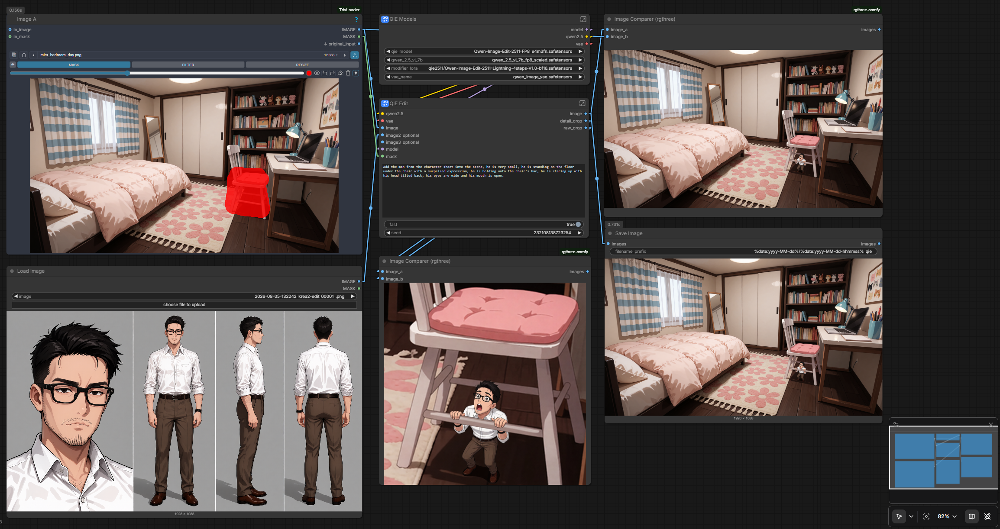

# comfy-workflows

- [comfy-workflows](#comfy-workflows)
  - [Flux 2 Klein 9b](#flux-2-klein-9b)
    - [F2K9b Detailer](#f2k9b-detailer)
  - [Krea 2](#krea-2)
    - [Krea 2 Character Composite](#krea-2-character-composite)
    - [Krea 2 Character Sheet](#krea-2-character-sheet)
    - [Krea 2 Detailer](#krea-2-detailer)
    - [Krea 2 UI-Icons](#krea-2-ui-icons)
  - [Minimax H3](#minimax-h3)
    - [H3 Prompt](#h3-prompt)
      - [H3 Prompt Generators](#h3-prompt-generators)
    - [H3 Detailer](#h3-detailer)
      - [H3 SAM3 Detailer](#h3-sam3-detailer)
      - [H3 Yolo Detailer](#h3-yolo-detailer)
    - [H3 Ref-to-video](#h3-ref-to-video)
      - [Product + character](#product--character)
  - [Qwen Image Edit](#qwen-image-edit)
    - [QIE Character Emplace](#qie-character-emplace)
 
## Flux 2 Klein 9b
### [F2K9b Detailer](Flux2Klein9b/detailer/f2k9b-i2i-detailer.json)
Detailer to work with high resolution sources, with finer control over changed areas.

## Krea 2
### [Krea 2 Character Composite](Krea2/character-composite/krea2-i2i-character-composite.json)
Use multiple reference characters in a scene. Uses the [identity edit lora](https://huggingface.co/conradlocke/krea2-identity-edit/blob/main/krea2_identity_edit_v1_2.safetensors).

### [Krea 2 Character Sheet](Krea2/character-sheet/krea2-i2i-character-sheet.json)
Character sheet generation from source image. Uses the [identity edit lora](https://huggingface.co/conradlocke/krea2-identity-edit/blob/main/krea2_identity_edit_v1_2.safetensors). Source character should be in a somewhat neutral pose, using a source with dynamic poses is likely to fail.

### [Krea 2 Detailer](Krea2/detailer/)
Improves detail of images. Limited to the abilities of a non-edit model, style changes and detail improvement work well, major modifications are less reliable. Results are more consistent when using images initially generated with Krea 2.

### [Krea 2 UI-Icons](Krea2/ui-icon/)
Simple workflow for generating alphas or icons for UI work. Crops the image to the subject's boundaries and returns the image with alpha transparency. A plain background helps to isolate the subject cleanly.

## Minimax H3
### H3 Prompt

#### [H3 Prompt Generators](MinimaxH3/prompt-generator/)
Fast simple prompt generators using Qwen 3 VL 4b, primarily for quickly putting a starting point together. Separate generators for text-to-video, image-to-video, and ref-to-video prompts. The ref-to-video generator will hallucinate inputs, extra <Audio> and <Picture> subjects that seem contextually appropriate, but otherwise it works surprisingly well.

Text-to-video, image-to-video, reference-to-video prompt generation subgraphs using Qwen3 VL 4b.

### H3 Detailer
Improve detail of low-resolution areas: faces, text, etc. The detailers crop, resample, then stitch the high-resolution generation back into the original-resolution input, while the audio is frozen and passed through. The video detailers are mask-agnostic, you can use SAM, yolo, or draw any arbitrary mask to feed into the detailer. They support the reference model well, but zero-reference detailing works fine too. They work down to 3 steps, with diminishing returns passed 6 steps. Denoise should be set based on a per-subject need, between 0.4-0.75. When using references, there's almost no chance of losing subject identity.

#### [H3 SAM3 Detailer](MinimaxH3/detailer-sam3/)
<video controls src="https://github.com/user-attachments/assets/f2b3066a-0eb4-4ccc-abb4-cfda604e864c"></video>

#### [H3 Yolo Detailer](MinimaxH3/detailer-yolo/)
<video controls src="https://github.com/user-attachments/assets/ef67fc9f-0a2a-4cab-b109-507b88069db6"></video>

### H3 Ref-to-video
#### [Product + character](MinimaxH3/ref-to-video-product/)
Example of combining a charcter with an object.

<video controls src="https://github.com/user-attachments/assets/85d6339c-dc9d-47e0-97b4-4c41aba2820d" style="max-height:400px"></video>

## Qwen Image Edit
### [QIE Character Emplace](QwenImageEdit/character-emplace/)
Emplace a character within a scene with controllable boundaries and scale. The masked region is rectified to a square compatible with flux kontext resolution (1024x1024). Works well with editing small regions within a larger image that would not fit QIE's scale requirements.

